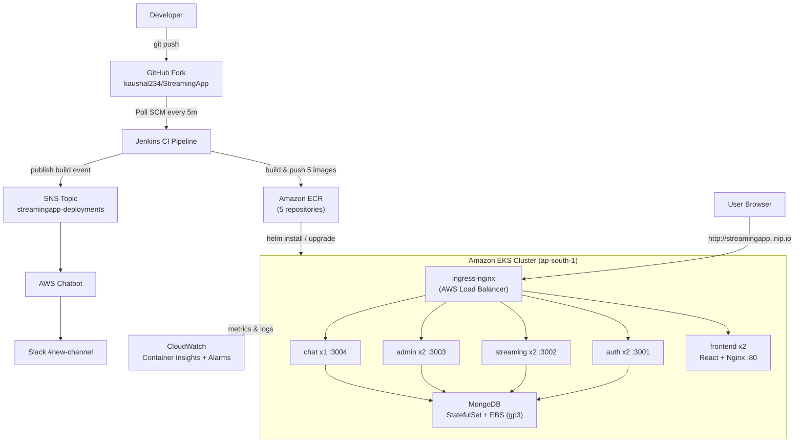

# StreamingApp — Container Orchestration & Scaling

An end-to-end DevOps project that takes a real multi-service MERN streaming
application, containerizes it, ships it through a **Jenkins CI pipeline** to
**Amazon ECR**, deploys it to a production-style **Amazon EKS** cluster via a
**Helm chart** exposed through **Ingress**, and layers on **CloudWatch**
monitoring/logging and **Slack ChatOps** alerts.

> The app runs on the cluster end-to-end — register, login, browse the video
> catalogue, and live chat across two clients all work through a single Ingress
> host.

- **Application repo (fork):** https://github.com/kaushal234/StreamingApp
- **Upstream:** https://github.com/UnpredictablePrashant/StreamingApp
- **Container images (Docker Hub):** https://hub.docker.com/u/kaushalhub234
- **Region:** `ap-south-1` (Mumbai)

---

## Architecture



### Services

| Service | Port | Role | Health endpoint |
|---|---|---|---|
| frontend | 80 | React SPA served via Nginx | `/` |
| authService | 3001 | Registration, login, JWT issuance | `/health` |
| streamingService | 3002 | Video catalogue, S3 playback | `/api/health` |
| adminService | 3003 | Asset management & signed uploads | `/api/health` |
| chatService | 3004 | WebSocket (Socket.IO) + REST live chat | `/api/health` |
| MongoDB | 27017 | Shared database (StatefulSet + PVC) | TCP 27017 |

### Ingress routing (single host, path-based)

Paths are matched by prefix specificity (longest match first), so **no path
rewriting is required**:

| Path | Backend | Notes |
|---|---|---|
| `/socket.io` | chat:3004 | WebSocket upgrade (Socket.IO) |
| `/api/streaming` | streaming:3002 | |
| `/api/admin` | admin:3003 | |
| `/api/chat` | chat:3004 | REST chat history |
| `/api` | auth:3001 | catch-all for `/api/login`, `/api/register`, etc. |
| `/` | frontend:80 | React SPA |

---

## Tech stack

Docker · Docker Hub · Amazon ECR · Kubernetes · Minikube (local) · Amazon EKS
(cloud) · Helm 3/4 · ingress-nginx · Jenkins · Amazon CloudWatch (Container
Insights) · Amazon SNS + AWS Chatbot + Slack.

---

## Repository structure

```
StreamingApp/
├── backend/                 # 4 Node.js microservices (auth, streaming, admin, chat)
├── frontend/                # React SPA (multi-stage Docker build → Nginx)
│   ├── Dockerfile           # builds with REACT_APP_* URLs baked in at build time
│   └── nginx.conf           # SPA fallback (try_files → index.html)
├── k8s/                     # Raw Kubernetes manifests (dev/reference)
│   ├── configmap.yaml
│   ├── secret.yaml
│   ├── mongo.yaml           # headless Service + StatefulSet + PVC
│   ├── auth.yaml / streaming.yaml / admin.yaml / chat.yaml / frontend.yaml
│   └── ingress.yaml
├── streamingapp/            # Helm chart (the packaged deployable)
│   ├── Chart.yaml
│   ├── values.yaml          # single source of truth (images, tags, replicas, ports, env, ingress)
│   └── templates/           # configmap, secret, mongo, deployments (loop), services (loop), ingress
├── values-eks.yaml          # EKS override: points images at ECR
├── gp3-storageclass.yaml    # default gp3 StorageClass for EKS (EBS CSI)
├── Jenkinsfile              # CI pipeline: build → push to ECR → notify SNS
├── docker-compose.yml       # local all-in-one run
└── docs/
    └── DEPLOYMENT.md        # detailed step-by-step runbook
```

---

## Quick start

### Prerequisites
Docker, kubectl, Helm 3+, and either Minikube (local) or an EKS cluster with an
ingress controller. AWS CLI + eksctl for the cloud path.

### Deploy locally (Minikube)

```bash
minikube start --driver=docker --cpus=4 --memory=3000
minikube addons enable ingress

helm install streamingapp ./streamingapp
kubectl get pods                       # wait for all pods 1/1 Running
kubectl exec deploy/streamingapp-streaming -- npm run seed   # seed sample videos
```

Add `127.0.0.1 streamingapp.local` to your hosts file, run `minikube tunnel`,
then open **http://streamingapp.local**.

### Deploy to AWS EKS

```bash
# Cluster
eksctl create cluster --name streamingapp --region ap-south-1 --nodes 2 --node-type t3.medium --managed

# Storage driver (EKS needs the EBS CSI driver + a default StorageClass)
kubectl apply -f gp3-storageclass.yaml

# Ingress controller (provisions an AWS Load Balancer)
helm upgrade --install ingress-nginx ingress-nginx \
  --repo https://kubernetes.github.io/ingress-nginx \
  --namespace ingress-nginx --create-namespace

# Deploy the app, pointing images at ECR and setting the Ingress host
helm install streamingapp ./streamingapp -f values-eks.yaml \
  --set ingress.host=streamingapp.<LB-IP>.nip.io \
  --set config.clientUrls="http://streamingapp.<LB-IP>.nip.io\,http://localhost:3000"

kubectl exec deploy/streamingapp-streaming -- npm run seed
```

Reach the app at **http://streamingapp.\<LB-IP\>.nip.io** (the LB IP comes from
`kubectl get svc -n ingress-nginx`). Full command-by-command details, including
ECR setup and the EBS CSI driver, are in [`DEPLOYMENT.md`](DEPLOYMENT.md).

---

## Configuration

Everything tunable lives in **`streamingapp/values.yaml`** — nothing is
hardcoded in `templates/`:

- `services.<name>.{image, tag, replicas, port, healthPath, sharedEnv}`
- `config.*` → rendered into the ConfigMap (MONGO_URI, CLIENT_URLS, AWS_REGION, …)
- `secret.*` → rendered into the Secret (JWT_SECRET, AWS keys)
- `rollingUpdate.{maxUnavailable, maxSurge}` → zero-downtime strategy (0 / 1)
- `ingress.{host, className}` and `mongo.storageSize`

`values-eks.yaml` is a thin override that swaps the image references from Docker
Hub to the ECR registry for the AWS deployment.

**Note on the frontend:** the React app bakes its API URLs in at *build time*
(`REACT_APP_*` build args), so the frontend image is rebuilt per environment
with the correct Ingress host (`streamingapp.local` locally,
`streamingapp.<LB-IP>.nip.io` on EKS).

---

## CI/CD (Jenkins)

The `Jenkinsfile` defines a declarative pipeline:

1. **Checkout** the repo
2. **ECR Login** (Docker authenticates to the private registry)
3. **Build & Push** all 5 images, tagged with the Jenkins `${BUILD_NUMBER}`
4. **Post** — publishes a structured build event to the SNS topic (success/failure)

The pipeline is configured with **Poll SCM (`H/5 * * * *`)** so it triggers
automatically on new commits. AWS credentials are supplied via scoped Jenkins
credentials (never committed to the repo).

## Monitoring & Logging (CloudWatch)

The **CloudWatch Observability (Container Insights)** EKS add-on collects:
- **Metrics** — cluster/node/pod CPU, memory, restarts (Container Insights dashboards)
- **Logs** — centralized under `/aws/containerinsights/streamingapp/{application,dataplane,host,performance}`
- **Alarm** — `streamingapp-high-cpu` on `node_cpu_utilization`

## ChatOps (SNS → AWS Chatbot → Slack)

Deployment/build events are published to the SNS topic
`streamingapp-deployments`, which is subscribed to **AWS Chatbot** and routed to
a **Slack** channel. The Jenkins pipeline emits a formatted "Build Success /
Failed" notification on every run using Chatbot's custom notification schema.

## Scaling & zero-downtime updates

- **Scale:** `kubectl scale deploy/streamingapp-streaming --replicas=4`
- **Rolling update:** `helm upgrade streamingapp ./streamingapp --set services.auth.tag=<new>` — every Deployment uses `maxUnavailable: 0, maxSurge: 1`, so a new pod is Ready before an old one is removed (verified via `kubectl rollout status`).
- **Self-heal:** deleting a pod triggers automatic recreation by the ReplicaSet.

---

## Production considerations

For a real production cluster, several things would change from this setup.
Workloads would be split into **dedicated namespaces** (per-environment and
per-team) rather than everything in `default`, with `NetworkPolicies` and
`ResourceQuotas`. The Ingress would serve **TLS** via cert-manager (Let's
Encrypt or ACM) instead of plain HTTP, behind a real DNS domain rather than
nip.io. Scaling would be automated with the **Horizontal Pod Autoscaler** (and
Cluster Autoscaler / Karpenter for nodes) driven by CPU/memory or custom
metrics, instead of manual `kubectl scale`. **Secrets** would never live in the
Helm values or git — they'd come from AWS Secrets Manager (via the CSI Secrets
Store driver) or Sealed Secrets, with the app's AWS access using **IRSA**
(IAM Roles for Service Accounts) rather than static keys, and all IAM scoped to
**least privilege** instead of the broad policies used here for expedience.
MongoDB would move to a managed, replicated service (DocumentDB or Atlas) rather
than a single-replica StatefulSet, and chat's WebSocket layer would use sticky
sessions with multiple replicas. Finally, CI credentials would live on a
dedicated, private Jenkins (or a managed CI) rather than a shared instance, and
image tags would be immutable and content-addressed for reproducible rollbacks.

---

## Deliverables

- ✅ Public GitHub repo with the Helm chart (`Chart.yaml`, `values.yaml`, `templates/`)
- ✅ 5 container images on Docker Hub (`kaushalhub234/streaming-*`) and Amazon ECR
- ✅ Jenkins CI pipeline (build → push to ECR, auto-trigger on commit)
- ✅ App running on Amazon EKS, reachable via Ingress
- ✅ CloudWatch monitoring, centralized logging, and an alarm
- ✅ (Bonus) SNS → AWS Chatbot → Slack ChatOps notifications
- ✅ Documentation (this README + `DEPLOYMENT.md`) and screenshots